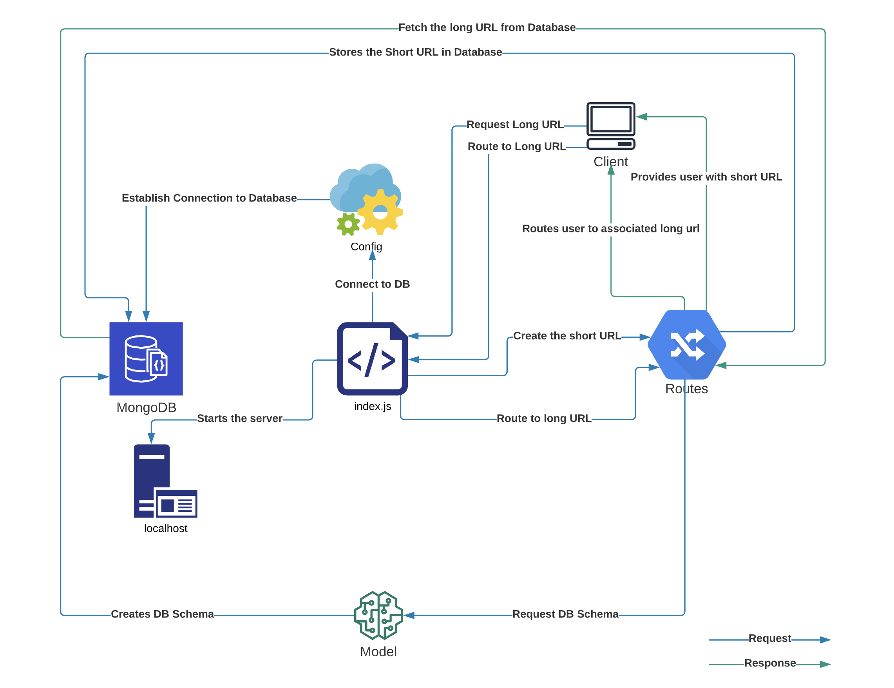
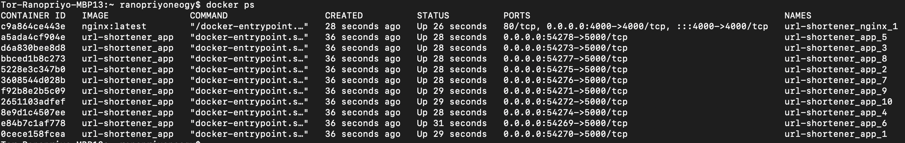

# Overview

This is a url shortener service that takes a long url from the user and makes it shorter. The backend used for this service is MongoDB Atlas. The service takes two types of requests. The first request is generating the short url based on long url input and stores it in MongoDB database. The second request is for routing the short url to the associated long url stored in the database.

## How to use

- Clone the repository using `git clone https://github.com/ranopriyo-neogy/url-shortener.git`
- Get into the project folder using `cd url-shortener`
- Make sure you have docker installed and running in your system. 
- Run `docker-compose up` 
- From any REST Client hit - `http://localhost:4000/api/url/shorten` with `POST` operation and pass a long url in below JSON format:
```
{
    "longUrl": "Enter your long URL Here"
}
```
- The Response will be having the short url.
- Then we can try hitting the short url and it will route us to the associated long url.

## Request and Response - REST Client


## High Level Service Architecture


## Detailed Service Architecture



## Scalability

The service can be scaled horizontally by adding more containers using docker command `docker-compose up --scale app=10`
This command will spin 10 docker containers in which the app will be running and in case one container stops working the load will be balanced in other containers.



## Load Balancer

The load balancing is done by Docker’s embedded DNS server, which will use a round robin implementation to resolve the DNS requests based on the service name and distribute them to the Docker containers. I have used NGINX service that listens at port 4000 for requests and forwards them to `url-shortener_app`. 

## Backend Database - MongoDB 

For testing purpose I have provided my application connection string in this project for connecting to the backend DB. However to build this from scratch one has to create an account in https://account.mongodb.com/account/login and define a cluster and connect using their respective Application connection string.


### MongoDB cost


## Developer

- [Ranopriyo Neogy](https://github.com/ranopriyo-neogy)
